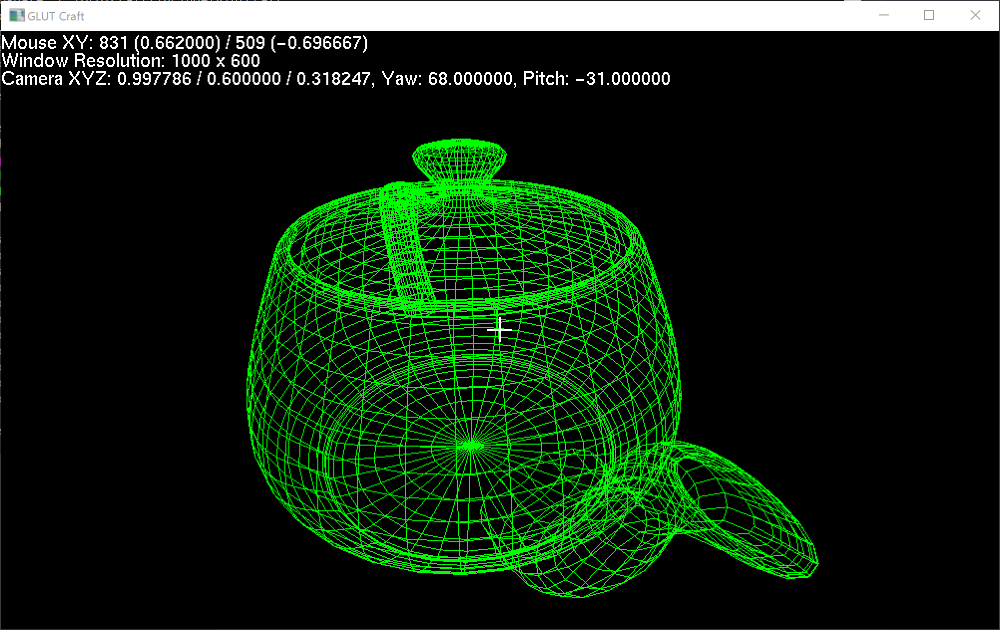

GLUTCraft - A 3D Game written in C with [Freeglut](http://freeglut.sourceforge.net)
====



This game is inspired by [Minecraft](https://www.minecraft.net), so you can discover some similarities. Just like [TravorOS](https://github.com/TravorLZH/TravorOS), it is still implementing basic features. Now you can browse the world using the same keys in Minecraft.

## Table of Contents

* [Features](#features)

	* [Implemented](#implemented)

	* [Developing](#developing)

* [Installation Guide](#installation-guide)

	* [Windows with MinGW](#windows-with-mingw)

	* [Linux](#linux)

## Features

I would like to list my features in this game. The feature list is basically the Work Plan of this game.

### Implemented

* **Resize Support** The display won't stretch if you stretch the window

* **Moving Camera** You can use <kbd>W</kbd>, <kbd>A</kbd>, <kbd>S</kbd>, <kbd>D</kbd> to move forward, left, backward, and right

* **Turning Head** You can use: <kbd>&uarr;</kbd>, <kbd>&darr;</kbd>, <kbd>&larr;</kbd>, and <kbd>&rarr;</kbd> to turn your head to different directions

* **Debug Screen** You can press <kbd>F3</kbd> to display data in the display.

* **Turning moving directions** The direction of head will decide the direction to move.

* **Crosshair in the center of screen** You can see a crosshair similar to Minecraft's in the screen.

### Developing

* **Turning head using mouse** Your mouse is always centered after pressing <kbd>M</kbd> because I am attempting to implement this features.

## Installation Guide

To build this game, you need to install the following packages first:

* [FreeGLUT](http://freeglut.sourceforge.net) It's necessary because all my code relies on it. Make sure the option **FREEGLUT_BUILD_SHARED_LIBS** is set to **ON**. To install it on Debian Linux, you may use the following command.

```
# apt-get update
# apt-get install freeglut3-dev
```

* [CMake](https://cmake.org") The building system I use because it supports building on different platforms.

### Windows with MinGW

If you are using [MinGW](http://mingw.org), you need to have `mingw32-make` installed. So type the following to build:

```shell
cmake . -G"MinGW Makefiles" -DCMAKE_INSTALL_PREFIX=%PREFIX%
mingw32-make
mingw32-make install
```

## Linux

[](https://asciinema.org/a/169118)

You must have `build-essential` installed. Then type:

```shell
cmake . -DCMAKE_INSTALL_PREFIX=$PREFIX
make
make install
```
